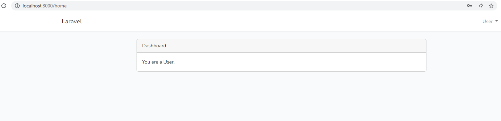
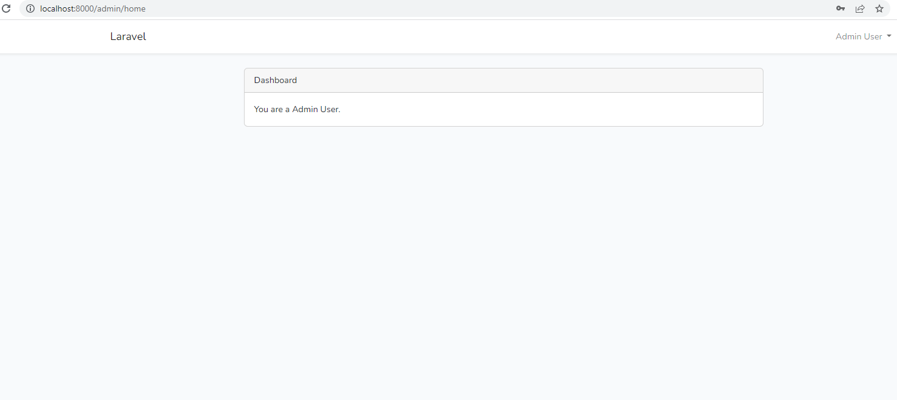
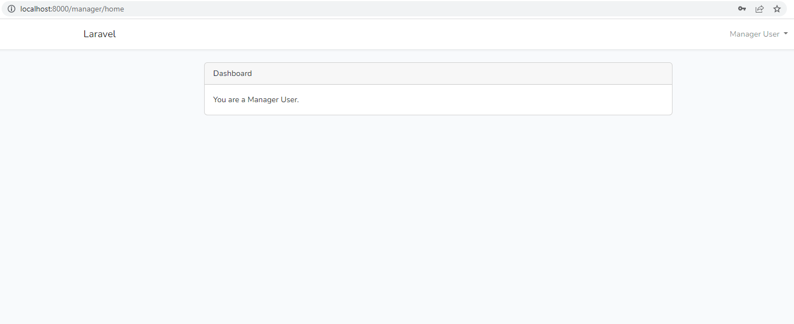

# laravel9_multi_auth_create_multiple_authentication
## 1: Install Laravel 9
```Dockerfile
composer create-project laravel/laravel laravel9_multi_auth_create_multiple_authentication
```
## 2: Database Configuration
- Vào .env
```Dockerfile
DB_CONNECTION=mysql
DB_HOST=127.0.0.1
DB_PORT=3306
DB_DATABASE=here your database name(blog)
DB_USERNAME=here database username(root)
DB_PASSWORD=here database password(root)
```
## 3: Update Migration and Model
- database/migrations/000_create_users_table.php
```Dockerfile
<?php
  
use Illuminate\Database\Migrations\Migration;
use Illuminate\Database\Schema\Blueprint;
use Illuminate\Support\Facades\Schema;
  
return new class extends Migration
{
    /**
     * Run the migrations.
     *
     * @return void
     */
    public function up()
    {
        Schema::create('users', function (Blueprint $table) {
            $table->id();
            $table->string('name');
            $table->string('email')->unique();
            $table->timestamp('email_verified_at')->nullable();
            $table->string('password');
            $table->tinyInteger('type')->default(0);
            /* Users: 0=>User, 1=>Admin, 2=>Manager */
            $table->rememberToken();
            $table->timestamps();
        });
    }
  
    /**
     * Reverse the migrations.
     *
     * @return void
     */
    public function down()
    {
        Schema::dropIfExists('users');
    }
};
```
- Chạy 
```Dockerfile
php artisan migrate
```
- Vào app/Models/User.php
```Dockerfile
<?php
  
namespace App\Models;
  
use Illuminate\Contracts\Auth\MustVerifyEmail;
use Illuminate\Database\Eloquent\Factories\HasFactory;
use Illuminate\Foundation\Auth\User as Authenticatable;
use Illuminate\Notifications\Notifiable;
use Laravel\Sanctum\HasApiTokens;
use Illuminate\Database\Eloquent\Casts\Attribute;
  
class User extends Authenticatable
{
    use HasApiTokens, HasFactory, Notifiable;
  
    /**
     * The attributes that are mass assignable.
     *
     * @var array

     */
    protected $fillable = [
        'name',
        'email',
        'password',
        'type'
    ];
  
    /**
     * The attributes that should be hidden for serialization.
     *
     * @var array

     */
    protected $hidden = [
        'password',
        'remember_token',
    ];
  
    /**
     * The attributes that should be cast.
     *
     * @var array

     */
    protected $casts = [
        'email_verified_at' => 'datetime',
    ];
 
    /**
     * Interact with the user's first name.
     *
     * @param  string  $value
     * @return \Illuminate\Database\Eloquent\Casts\Attribute
     */
    protected function type(): Attribute
    {
        return new Attribute(
            get: fn ($value) =>  ["user", "admin", "manager"][$value],
        );
    }
}
```
## 4: Create Auth using scaffold
- Laravel 9 UI Package:
```Dockerfile
composer require laravel/ui 
```
- Generate Auth:
```Dockerfile
php artisan ui bootstrap --auth 
```
```Dockerfile
npm install
```
```Dockerfile
npm run dev
```
## 5: Create UserAccess Middleware
- app/Http/middleware/UserAccess.php
```Dockerfile
<?php
  
namespace App\Http\Middleware;
  
use Closure;
use Illuminate\Http\Request;
  
class UserAccess
{
    /**
     * Handle an incoming request.
     *
     * @param  \Illuminate\Http\Request  $request
     * @param  \Closure(\Illuminate\Http\Request): (\Illuminate\Http\Response|\Illuminate\Http\RedirectResponse)  $next
     * @return \Illuminate\Http\Response|\Illuminate\Http\RedirectResponse
     */
    public function handle(Request $request, Closure $next, $userType)
    {
        if(auth()->user()->type == $userType){
            return $next($request);
        }
          
        return response()->json(['You do not have permission to access for this page.']);
        /* return response()->view('errors.check-permission'); */
    }
}
```
- app/Http/Kernel.php
```Dockerfile
....
protected $routeMiddleware = [
    'auth' => \App\Http\Middleware\Authenticate::class,
    'auth.basic' => \Illuminate\Auth\Middleware\AuthenticateWithBasicAuth::class,
    'bindings' => \Illuminate\Routing\Middleware\SubstituteBindings::class,
    'cache.headers' => \Illuminate\Http\Middleware\SetCacheHeaders::class,
    'can' => \Illuminate\Auth\Middleware\Authorize::class,
    'guest' => \App\Http\Middleware\RedirectIfAuthenticated::class,
    'signed' => \Illuminate\Routing\Middleware\ValidateSignature::class,
    'throttle' => \Illuminate\Routing\Middleware\ThrottleRequests::class,
    'verified' => \Illuminate\Auth\Middleware\EnsureEmailIsVerified::class,
    'user-access' => \App\Http\Middleware\UserAccess::class,
];
....
```
## 6: Create Routes
- routes/web.php
```Dockerfile
<?php
  
use Illuminate\Support\Facades\Route;
  
use App\Http\Controllers\HomeController;
  
/*
|--------------------------------------------------------------------------
| Web Routes
|--------------------------------------------------------------------------
|
| Here is where you can register web routes for your application. These
| routes are loaded by the RouteServiceProvider within a group which
| contains the "web" middleware group. Now create something great!
|
*/
  
Route::get('/', function () {
    return view('welcome');
});
  
Auth::routes();
  
/*------------------------------------------
--------------------------------------------
All Normal Users Routes List
--------------------------------------------
--------------------------------------------*/
Route::middleware(['auth', 'user-access:user'])->group(function () {
  
    Route::get('/home', [HomeController::class, 'index'])->name('home');
});
  
/*------------------------------------------
--------------------------------------------
All Admin Routes List
--------------------------------------------
--------------------------------------------*/
Route::middleware(['auth', 'user-access:admin'])->group(function () {
  
    Route::get('/admin/home', [HomeController::class, 'adminHome'])->name('admin.home');
});
  
/*------------------------------------------
--------------------------------------------
All Admin Routes List
--------------------------------------------
--------------------------------------------*/
Route::middleware(['auth', 'user-access:manager'])->group(function () {
  
    Route::get('/manager/home', [HomeController::class, 'managerHome'])->name('manager.home');
});
 
```
## 7: Update Controller
- app/Http/Controllers/HomeController.php
```Dockerfile
<?php
  
namespace App\Http\Controllers;
 
use Illuminate\Http\Request;
  
class HomeController extends Controller
{
    /**
     * Create a new controller instance.
     *
     * @return void
     */
    public function __construct()
    {
        $this->middleware('auth');
    }
  
    /**
     * Show the application dashboard.
     *
     * @return \Illuminate\Contracts\Support\Renderable
     */
    public function index()
    {
        return view('home');
    } 
  
    /**
     * Show the application dashboard.
     *
     * @return \Illuminate\Contracts\Support\Renderable
     */
    public function adminHome()
    {
        return view('adminHome');
    }
  
    /**
     * Show the application dashboard.
     *
     * @return \Illuminate\Contracts\Support\Renderable
     */
    public function managerHome()
    {
        return view('managerHome');
    }
}
```
## 8:  Create Blade file
- resources/views/home.blade.php
```Dockerfile
@extends('layouts.app')
  
@section('content')
<div class="container">
    <div class="row justify-content-center">
        <div class="col-md-8">
            <div class="card">
                <div class="card-header">{{ __('Dashboard') }}</div>
  
                <div class="card-body">
                    @if (session('status'))
                        <div class="alert alert-success" role="alert">
                            {{ session('status') }}
                        </div>
                    @endif
  
                    You are a User.
                </div>
            </div>
        </div>
    </div>
</div>
@endsection
```
- resources/views/adminHome.blade.php
```Dockerfile
@extends('layouts.app')
  
@section('content')
<div class="container">
    <div class="row justify-content-center">
        <div class="col-md-8">
            <div class="card">
                <div class="card-header">{{ __('Dashboard') }}</div>
  
                <div class="card-body">
                    You are a Admin User.
                </div>
            </div>
        </div>
    </div>
</div>
@endsection
```
- resources/views/managerHome.blade.php
```Dockerfile
@extends('layouts.app')
@section('content')
<div class="container">
    <div class="row justify-content-center">
        <div class="col-md-8">
            <div class="card">
                <div class="card-header">{{ __('Dashboard') }}</div>
  
                <div class="card-body">
                    You are a Manager User.
                </div>
            </div>
        </div>
    </div>
</div>
@endsection
```
## 9: Update on LoginController
- app/Http/Controllers/Auth/LoginController.php
```Dockerfile
<?php
  
namespace App\Http\Controllers\Auth;
  
use App\Http\Controllers\Controller;
use App\Providers\RouteServiceProvider;
use Illuminate\Foundation\Auth\AuthenticatesUsers;
use Illuminate\Http\Request;
  
class LoginController extends Controller
{
    /*
    |--------------------------------------------------------------------------
    | Login Controller
    |--------------------------------------------------------------------------
    |
    | This controller handles authenticating users for the application and
    | redirecting them to your home screen. The controller uses a trait
    | to conveniently provide its functionality to your applications.
    |
    */
  
    use AuthenticatesUsers;
  
    /**
     * Where to redirect users after login.
     *
     * @var string
     */
    protected $redirectTo = RouteServiceProvider::HOME;
  
    /**
     * Create a new controller instance.
     *
     * @return void
     */
    public function __construct()
    {
        $this->middleware('guest')->except('logout');
    }
 
    public function login(Request $request)
    {   
        $input = $request->all();
     
        $this->validate($request, [
            'email' => 'required|email',
            'password' => 'required',
        ]);
     
        if(auth()->attempt(array('email' => $input['email'], 'password' => $input['password'])))
        {
            if (auth()->user()->type == 'admin') {
                return redirect()->route('admin.home');
            }else if (auth()->user()->type == 'manager') {
                return redirect()->route('manager.home');
            }else{
                return redirect()->route('home');
            }
        }else{
            return redirect()->route('login')
                ->with('error','Email-Address And Password Are Wrong.');
        }
          
    }
}
```
## 10: Create Seeder
```Dockerfile
php artisan make:seeder CreateUsersSeeder
```
- database/seeders/CreateUsersSeeder.php
```Dockerfile
<?php
  
namespace Database\Seeders;
  
use Illuminate\Database\Console\Seeds\WithoutModelEvents;
use Illuminate\Database\Seeder;
use App\Models\User;
  
class CreateUsersSeeder extends Seeder
{
    /**
     * Run the database seeds.
     *
     * @return void
     */
    public function run()
    {
        $users = [
            [
               'name'=>'Admin User',
               'email'=>'admin@itsolutionstuff.com',
               'type'=>1,
               'password'=> bcrypt('123456'),
            ],
            [
               'name'=>'Manager User',
               'email'=>'manager@itsolutionstuff.com',
               'type'=> 2,
               'password'=> bcrypt('123456'),
            ],
            [
               'name'=>'User',
               'email'=>'user@itsolutionstuff.com',
               'type'=>0,
               'password'=> bcrypt('123456'),
            ],
        ];
    
        foreach ($users as $key => $user) {
            User::create($user);
        }
    }
}
```
- Chạy 
```Dockerfile
php artisan db:seed --class=CreateUsersSeeder
```
## 11: Run Laravel App:
```Dockerfile
php artisan serve
```
- Vào http://localhost:8000/
Normal User:
```Dockerfile
Email: user@itsolutionstuff.com
Password: 123456
```



Admin User:
```Dockerfile
Email: admin@itsolutionstuff.com
Password: 123456
```



Manager User:
```Dockerfile
Email: manager@itsolutionstuff.com
Password: 123456
```




